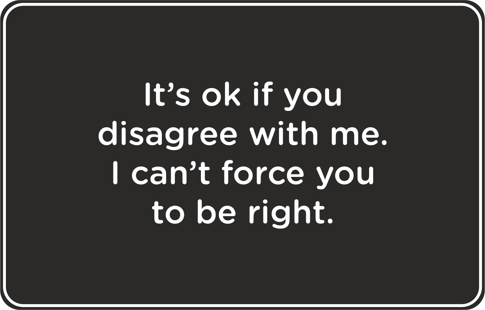

Nutanix Marvellous Workshop
===========================

In this workshop you'll learn new exciting content.

Section 1
+++++++++
Wouldn't it be good to show something in *italics*? Well, that was straightforward.

How about something in **bold**? Couldn't be more straightforward than that.

Spacing is important in Restructured Text so you may see errors simply because of space indents and tabs, or forgotten a closing **asterix**.

Also, if you want text to start on a new line then make sure you leave a blank line after the last paragraph.

RAW HTML code can be included if necessary.

.. raw:: html

  <strong>Something important because it's in red!</strong> Less exciting because it's in blue :-)  

Here's a nice way to make a ``command instruction`` stand out.

An additional library is defined in the **conf.py** file to make special characters available, for example:

:fa:`bars`, :fa:`check`, :fa:`square-o`

:fa: `arrow` 

Section 2
+++++++++
A description of something that would be benefit from a bullet list:

-   Item 1

-   Item 2

-   Item 3

Numbered bullets can have their place too:

#   Item 1

#   Item 2

#   Item 3

Well, that was easy.

Section 3
+++++++++
At times you may want to point out something of note, an advisory or something that simply stands out.

.. note:: Please ensure you've installed the correct version of blah before proceeding.

.. seealso:: There's another page you can click.

.. warning:: A little more emphasis using this syntax.

Quite simple when you know the syntax.

Section 4
+++++++++
It's time to include a graphic. This could be from screenshots you've been gathering or maybe you'd like to share something inspirational to liven the workshop up. Either way it's quite simple.

.. note:: Make sure you copy the image into the directory (or Folder for you Windows people).

This will display the image in its native resolution so it may be worth checking the dimensions and reducing down if necessary. As you can see this is large.

If you'd like to constrain the image width then additional height and width parameters can be included in the RST file, you can specify one or both. See the source of this file and look for the `width` parameter.

.. image:: /images/se-bootcamp-how-logo.png
 :width: 250

The image insert isn't too complicated.

Section 5
+++++++++
Online materials invariably require URLs to be included and to keep the flow of your text it's sensible to include a hyperlinked word or phrase rather than dump in a string of messy text 200+ characters long.

In my example here I'm suggesting to `click here`_ to see the latest information about the topic I'm talking about. In the source code notice the use of the underscore.

.. _click here: http://my.nutanix.com/

You may want to embed a link to a Google Sheet as you may have seen in recent New Hire Training. Again, this uses RAW HTML and an iframe.

.. raw:: html

   <iframe src="https://docs.google.com/spreadsheets/d/1I7eLudDdxvKQDYvTzLFAXVQaGFYUl4LSVFJDuKx0lEI/edit?usp=sharing" style="position: relative; height: 400px; width: 98%; border: none"></iframe>

That covers it.
